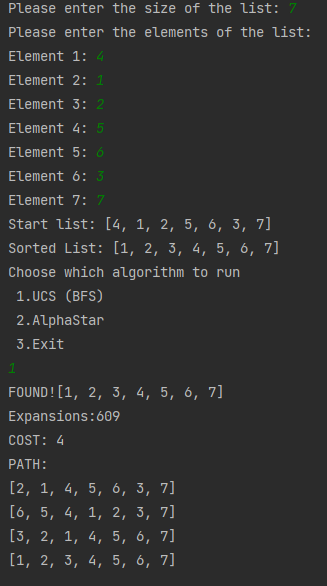
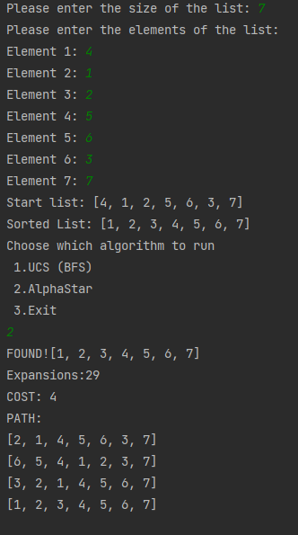
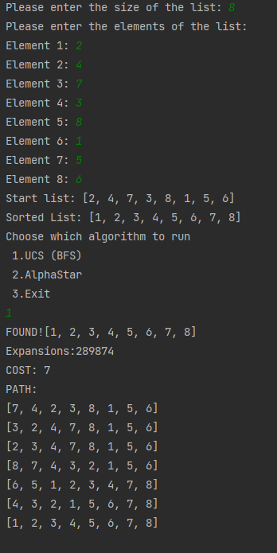
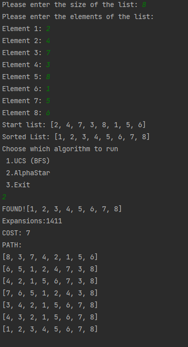
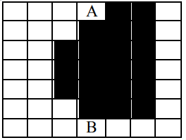

# Implementation of search algorithms and Minimax Game

## Introduction

This project consists of two parts. The first part is about solving a search problem using Uniform Cost
Search algorithm (UCS) and Alpha Star algorithm (A*). Main goal of this part is to compare the two algorithms
as the A* uses heuristics to guide its search. The second part is about building a simple game between player
and the computer using the Minimax algorithm for the decision making of the computer.

## Search Problem

___

## Problem Definition

Consider a list of length N with elements unique numbers from 1 to N (e.g. [1, 3, 4, 2, 5] **initial state**).
Therefore the **state space** of the problem is the permutations of the N numbers in the list. **Final state**
of the problem is the list with its elements in ascending order. The **transition operator** which is used is
the $T(k), ~~ 2\leq k \leq N$ and is defined as following:

Let $a = [a_1, ... , a_k, a_{k+1}, ... a_N]$ be a state and $T(k), ~~ 2\leq k \leq N$ the transition operator

If $T(k)$ is applied to $a$ then the resulting list would be $b = [a_k, a_{k-1}, ... a_1, a_{k+1}, ...,a_N]$

If $T(N)$ is applied to $a$ then the resulting list would be $b = [a_N, ..., a_1]$

**NOTE:** Every use of the operator has the cost of 1.

## Heuristic Function

The function that is used to guide A* search is a combination of two parts:

1. Check if the list is sorted in reverse (sorted in descending order) or if the first elements of the list
    are sorted in descending order and the rest are sorted (e.g. [3, 2, 1, 4, 5]). Similarly check if the
    first elements of the list are in sorted in descending order and the rest in ascending
    (e.g. [5, 4, 1, 2, 3]). For the first case the function returns 1 as the use of $Τ(Ν)$ will lead to the
    sorted list. For the second case the function returns 2 as the use of $Τ(Ν)$ results in the first case
    which is one step away from the sorted list.
    If none of the above cases are true then the second part is performed.

2. Estimate the cost of every state from the final state by swapping elements that are in the wrong position
   with ones that should be in that position for the list to be sorted. The estimate that the function returns
   is the number of steps that where needed to sort the list. In every swap that is applied the first part of
   the function is also checked.

## Results

Using several values for N it is clear that A* can reach the final state with less steps than UCS algorithm.
This difference is more visible when the two algorithms are used for lists with more elements.

|UCS|Alpha Star|
|:-:|:-:|
|||
|||

## Minimax Game

___

## Game Definition

This game consists of a MxN board and a player which plays against the computer. Each player has one pawn and can make
one move per turn. The pawns are allowed to moved similar to the chess queen. Every block that has been visited cannot
be revisited.

